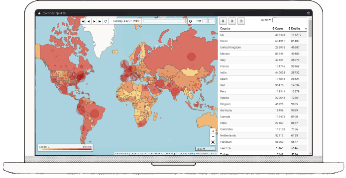
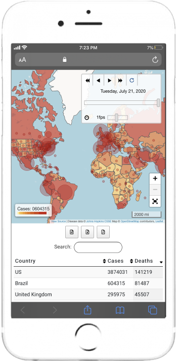
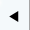
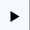
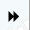
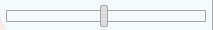
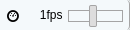
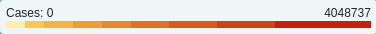

# Coronamap
Coronamap is an interactive thematic map with a date slider that enables users to play the animation to track the spread of coronavirus.<br/>
Have a look at the [Live demo](https://7ae.github.io/coronamap/dist/ "Coronamap Demo").

Coronamap is fully functional on the client-side and does not use any server. It scrapes publicly available data and stores them locally within the user's browser.

<p align="center"><a href="https://7ae.github.io/coronamap/dist/"></a> <a href="https://7ae.github.io/coronamap/dist/"></a></p>

## Preview

<p align="center"><a href="https://7ae.github.io/coronamap/dist/"></a></p>
Disease data © <a href="https://github.com/CSSEGISandData/COVID-19/blob/master/README.md">Johns Hopkins CSSE</a>

### Date Slider

The range of date slider automatically expands to include today's date.

<br>

-  : Backward button shows the previous day.
-  : Play Reverse button animates map backwards.
-  : Play button animates map forwards.
-  : Forward button shows the next day.
-  : Loop button loops animation from the start to end, or vice versa.
-  : Click a point in date slider to see a specific day.
-  : Frame rate slider can speed up or slow down animation. (Normal speed: 1 fps)

### Colored Geographical Areas



Countries, regions, sovereignties are colored according to **number of infected cases**. As one can see the legend at bottom left, brighter/yellow areas have relatively fewer infected cases, whereas darker/red areas have releatively more infected cases.

### Circle Markers

    

Circles are sized according to **number of deaths**. Bigger circles mean more deaths, whereas smaller circles mean fewer deaths. Hover your mouse over a circle marker to see tooltip with the associated territory's name and number of infected cases and deaths.

### Downloading Map Data

You can save table with per-country daily confirmed case and death counts as multiple file formats.

-  : Save table as csv file (.csv)
-  : Save table as excel spreadsheet (.xlsx)
-  : Save table as pdf (.pdf)

## Getting Started

### Prerequisites

* Node.js
```bash
$ sudo yum install nodejs
$ sudo yum install npm
```

* Install npm packages
```bash
npm install
```

### Development
* Watch for updates to code and compile automatically: `npm run develop`
* Build the optimized production: `npm run build`
* Run all unit tests: `npm run test`
